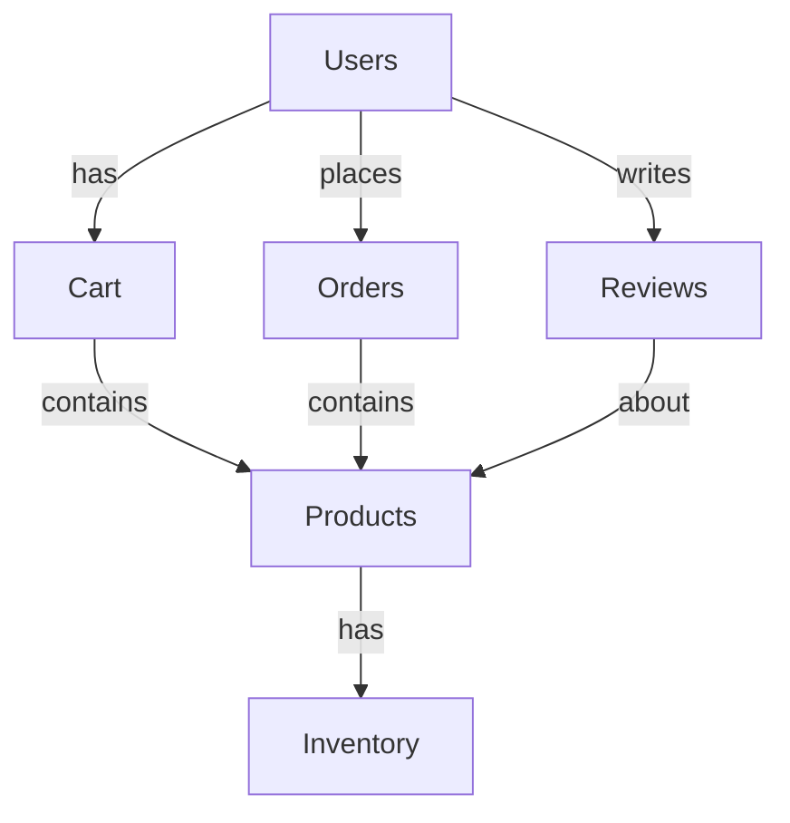

# NoSQL Database Design for E-Commerce Application

## Overview

This repository contains a comprehensive NoSQL database design for a high-performance e-commerce platform capable of handling thousands of transactions per second. The design addresses critical requirements including product catalog management, order processing, user management, and review systems. Additionally, it includes a refactored architecture that supports large-scale analytics and ensures high availability with partition tolerance.

The design follows industry best practices for NoSQL databases, leveraging the strengths of document-oriented storage while mitigating common pitfalls through strategic denormalization, indexing, and sharding.

## Table of Contents

- [Requirements Analysis](#requirements-analysis)
- [Technology Selection](#technology-selection)
- [Initial Design](#part-1-initial-design-based-on-requirements)
  - [Key Entities](#key-entities-identification)
  - [NoSQL Model Selection](#nosql-model-selection)
  - [Schema Design](#schema-design)
  - [Indexes and Query Patterns](#indexes-and-query-patterns)
  - [Scalability Considerations](#scalability-and-consistency-considerations)
- [Refactored Design](#part-2-refactored-design-for-new-requirements)
  - [Analytics Implementation](#analytics-requirement)
  - [High Availability](#high-availability-implementation)
  - [Refactored Schema](#refactored-schema-examples)
- [Performance Benchmarks](#performance-benchmarks)
- [Deployment Strategy](#deployment-strategy)
- [Monitoring and Maintenance](#monitoring-and-maintenance)
- [Security Considerations](#security-considerations)
- [Reflection](#reflection-on-refactoring)
- [Implementation Examples](#implementation-examples)

## Requirements Analysis

The e-commerce platform must satisfy the following functional and non-functional requirements:

### Functional Requirements

1. **Product Management**

   - Support for complex product hierarchies and varied attributes across categories
   - Inventory tracking with real-time updates
   - Support for product variants (size, color, etc.)
   - Rich media storage for product images and videos

2. **User Management**

   - User profile storage and authentication
   - Address and payment method management
   - Order history tracking
   - Personalization data storage

3. **Order Processing**

   - Multi-item order creation and management
   - Order status tracking and history
   - Payment processing integration
   - Shipping and delivery tracking

4. **Search and Discovery**
   - Full-text search capabilities
   - Faceted navigation and filtering
   - Recommendation engine support
   - Category and tag-based browsing

### Non-Functional Requirements

1. **Performance**

   - Support for thousands of transactions per second
   - Sub-100ms response time for product browsing
   - Sub-500ms response time for search operations
   - Sub-1s response time for order placement

2. **Scalability**

   - Horizontal scaling for growing product catalog (millions of SKUs)
   - Support for seasonal traffic spikes (10x normal traffic)
   - Linear performance scaling with additional nodes

3. **Availability**

   - 99.99% uptime for browsing and search
   - 99.999% uptime for order processing
   - Resilience against regional outages

4. **Data Integrity**
   - Strong consistency for inventory and order operations
   - Eventual consistency acceptable for product browsing
   - Zero data loss for financial transactions

## Technology Selection

After evaluating various NoSQL database technologies against our requirements, we selected the following stack:

| Requirement          | Selected Technology | Justification                                                  |
| -------------------- | ------------------- | -------------------------------------------------------------- |
| Primary Data Store   | MongoDB             | Flexible schema, rich query language, strong ecosystem         |
| Search Functionality | Elasticsearch       | Superior full-text search, faceting capabilities               |
| Caching Layer        | Redis               | High-performance, support for complex data structures          |
| Analytics Data Store | Cassandra           | Linear scalability for time-series data, high write throughput |
| Message Queue        | Kafka               | Reliable event streaming for system integration                |

### MongoDB Advantages for E-Commerce

1. **Flexible Schema**: Accommodates varying product attributes across categories
2. **Rich Query Language**: Supports complex queries needed for product filtering
3. **Geospatial Indexing**: Enables location-based features like store locators
4. **Horizontal Scaling**: Native sharding for handling large catalogs and traffic
5. **Multi-Document ACID Transactions**: Critical for order processing integrity

## Part 1: Initial Design Based on Requirements

### Key Entities Identification

Our domain model consists of the following core entities:

1. **Users**: Customer profiles, authentication, preferences, and history
2. **Products**: Product catalog with hierarchical categorization and attributes
3. **Inventory**: Real-time stock levels across warehouses and stores
4. **Orders**: Transaction records with line items and fulfillment details
5. **Reviews**: Customer feedback and ratings
6. **Carts**: Active shopping sessions

The entity relationship diagram below illustrates the relationships between these entities:

